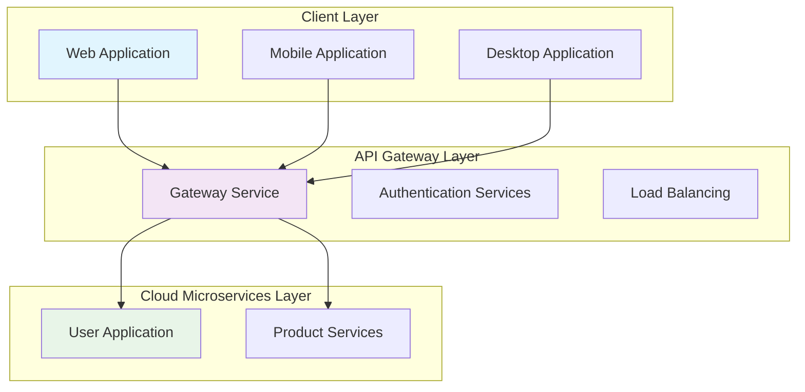
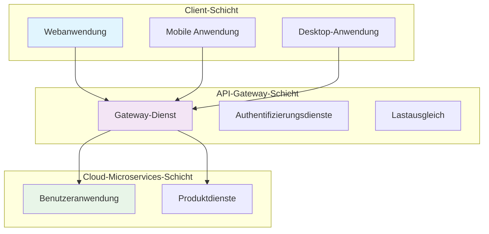

 [](https://products.aspose.cloud/cells/ruby/) [](https://docs.aspose.cloud/cells/) [](https://reference.aspose.cloud/cells/) [](https://github.com/aspose-cells-cloud/aspose-cells-cloud-perl/tree/master/Examples) [](https://blog.aspose.cloud/categories/aspose.cells-cloud-product-family/) [](https://forum.aspose.cloud/c/cells/7) [](https://rubygems.org/gems/aspose_cells_cloud) [](https://github.com/aspose-cells-cloud/aspose-cells-cloud-ruby/archive/refs/heads/master.zip) [](https://github.com/aspose-cells-cloud/aspose-cells-cloud-ruby/blob/master/LICENSE) 

# Aspose.Cells Cloud SDK for Ruby

[Aspose.Cells Cloud SDK for Ruby](https://products.aspose.cloud/cells/ruby) is a cloud-native REST API that enables Ruby developers to **create**, **read**, **edit**, **convert**, and **repair** spreadsheet files—including **Excel** (**XLS**, **XLSX**, **XLSB**, **XLSM**), **OpenDocument Spreadsheet** (**ODS**), **CSV**, **TSV**, **JSON**, **HTML**, **PDF**, and **more**—without requiring Microsoft Excel or Office to be installed.

Built on the **Aspose.Cells Cloud Web API**, this MIT-licensed SDK supports advanced spreadsheet operations such as:

- Cell formatting, formulas, and data validation
- Pivot tables, charts, hyperlinks, and comments
- Conditional formatting and smart markers
- Worksheet merging, splitting, and protection
- Batch processing and background removal

It seamlessly integrates with **AWS**, **Microsoft Azure**, and **Google Cloud**, ensuring **high availability**, **scalability**, and **data integrity**. Ideal for serverless apps, microservices, and cloud automation workflows.

## Quick Start Guide

To get started with Aspose.Cells Cloud, here's what you need to do:

1. Sign up for an account at [Aspose for Cloud](https://dashboard.aspose.cloud/#/apps) to obtain your application details.
2. Install the Aspose.Cells Cloud Ruby Package from [RubyGems](https://rubygems.org/).

- Execute the following command to get the latest Gem package.

```console
gem 'aspose_cells_cloud', '~> 26.8.0'
```

Or install directly:

```console
gem install aspose_cells_cloud
```

3. Use the conversion code provided below as a reference to add or modify your application.

```ruby
require 'openssl'
require 'bundler'
require 'aspose_cells_cloud'

CellsCloudClientId = "..."  # Get from https://dashboard.aspose.cloud/#/applications -> Set ENV['CellsCloudClientId']
CellsCloudClientSecret = "..."   # Get from https://dashboard.aspose.cloud/#/applications -> Set ENV['CellsCloudClientSecret']

@instance = AsposeCellsCloud::CellsApi.new(CellsCloudClientId, CellsCloudClientSecret)
request = AsposeCellsCloud::ConvertSpreadsheetRequest.new(:Spreadsheet => 'EmployeeSalesSummary.xlsx', :format => format)
response = @instance.convert_spreadsheet(request)
FileUtils.cp(response.path, 'EmployeeSalesSummary.csv')
```

4. How to upload a file to cloud storage.

```ruby
require 'openssl'
require 'bundler'
require 'aspose_cells_cloud'

CellsCloudClientId = "..."  # Get from https://dashboard.aspose.cloud/#/applications -> Set ENV['CellsCloudClientId']
CellsCloudClientSecret = "..."   # Get from https://dashboard.aspose.cloud/#/applications -> Set ENV['CellsCloudClientSecret']

@instance = AsposeCellsCloud::CellsApi.new(CellsCloudClientId, CellsCloudClientSecret)
request = AsposeCellsCloud::UploadFileRequest.new(:UploadFiles => "EmployeeSalesSummary.xlsx", :path => "TestData/EmployeeSalesSummary.xlsx", :storageName => '')
@instance.upload_file(request)
```

## Supported File Formats

| **Format**                                                        | **Description**                                                                                                                                               | **Load** | **Save** |
| :---------------------------------------------------------------- | :------------------------------------------------------------------------------------------------------------------------------------------------------------ | :------- | :------- |
| [XLS](https://docs.fileformat.com/spreadsheet/xls/)               | Excel 95/5.0 - 2003 Workbook.                                                                                                                                 | &radic;  | &radic;  |
| [XLSX](https://docs.fileformat.com/spreadsheet/xlsx/)             | Office Open XML SpreadsheetML Workbook or template file, with or without macros.                                                                              | &radic;  | &radic;  |
| [XLSB](https://docs.fileformat.com/spreadsheet/xlsb/)             | Excel Binary Workbook.                                                                                                                                        | &radic;  | &radic;  |
| [XLSM](https://docs.fileformat.com/spreadsheet/xlsm/)             | Excel Macro-Enabled Workbook.                                                                                                                                 | &radic;  | &radic;  |
| [XLT](https://docs.fileformat.com/spreadsheet/xlt/)               | Excel 97 - Excel 2003 Template.                                                                                                                               | &radic;  | &radic;  |
| [XLTX](https://docs.fileformat.com/spreadsheet/xltx/)             | Excel Template.                                                                                                                                               | &radic;  | &radic;  |
| [XLTM](https://docs.fileformat.com/spreadsheet/xltm/)             | Excel Macro-Enabled Template.                                                                                                                                 | &radic;  | &radic;  |
| [XLAM](https://docs.fileformat.com/spreadsheet/xlam/)             | An Excel Macro-Enabled Add-In file used to add new functions to Excel.                                                                                        |          | &radic;  |
| [CSV](https://docs.fileformat.com/spreadsheet/csv/)               | CSV (Comma-Separated Values) file.                                                                                                                            | &radic;  | &radic;  |
| [TSV](https://docs.fileformat.com/spreadsheet/tsv/)               | TSV (Tab-Separated Values) file.                                                                                                                              | &radic;  | &radic;  |
| [TXT](https://docs.fileformat.com/word-processing/txt/)           | Delimited plain text file.                                                                                                                                    | &radic;  | &radic;  |
| [HTML](https://docs.fileformat.com/web/html/)                     | HTML format.                                                                                                                                                  | &radic;  | &radic;  |
| [MHTML](https://docs.fileformat.com/web/mhtml/)                   | MHTML file.                                                                                                                                                   | &radic;  | &radic;  |
| [ODS](https://docs.fileformat.com/spreadsheet/ods/)               | ODS (OpenDocument Spreadsheet).                                                                                                                               | &radic;  | &radic;  |
| [Numbers](https://docs.fileformat.com/spreadsheet/numbers/)       | Document created by Apple's "Numbers" application, part of Apple's iWork office suite running on macOS and iOS.                                               | &radic;  |          |
| [JSON](https://docs.fileformat.com/web/json/)                     | JavaScript Object Notation                                                                                                                                    | &radic;  | &radic;  |
| [DIF](https://docs.fileformat.com/spreadsheet/dif/)               | Data Interchange Format.                                                                                                                                      |          | &radic;  |
| [PDF](https://docs.fileformat.com/pdf/)                           | Adobe Portable Document Format.                                                                                                                               |          | &radic;  |
| [XPS](https://docs.fileformat.com/page-description-language/xps/) | XML Paper Specification Format.                                                                                                                               |          | &radic;  |
| [SVG](https://docs.fileformat.com/page-description-language/svg/) | Scalable Vector Graphics Format.                                                                                                                              |          | &radic;  |
| [TIFF](https://docs.fileformat.com/image/tiff/)                   | Tagged Image File Format                                                                                                                                      |          | &radic;  |
| [PNG](https://docs.fileformat.com/image/png/)                     | Portable Network Graphics Format                                                                                                                              |          | &radic;  |
| [BMP](https://docs.fileformat.com/image/bmp/)                     | Bitmap Image Format                                                                                                                                           |          | &radic;  |
| [EMF](https://docs.fileformat.com/image/emf/)                     | Enhanced Metafile Format                                                                                                                                      |          | &radic;  |
| [JPEG](https://docs.fileformat.com/image/jpeg/)                   | JPEG is a type of image format saved using lossy compression.                                                                                                 |          | &radic;  |
| [GIF](https://docs.fileformat.com/image/gif/)                     | Graphics Interchange Format                                                                                                                                   |          | &radic;  |
| [MARKDOWN](https://docs.fileformat.com/word-processing/md/)       | Represents a Markdown document.                                                                                                                               |          | &radic;  |
| [SXC](https://docs.fileformat.com/spreadsheet/sxc/)               | An XML-based format used by OpenOffice and StarOffice                                                                                                         | &radic;  | &radic;  |
| [FODS](https://docs.fileformat.com/spreadsheet/fods/)             | An Open Document format stored as flat XML.                                                                                                                   | &radic;  | &radic;  |
| [DOCX](https://docs.fileformat.com/word-processing/docx/)         | A well-known format for Microsoft Word documents that combines XML and binary files.                                                                          |          | &radic;  |
| [PPTX](https://docs.fileformat.com/presentation/pptx/)            | Microsoft PowerPoint Open XML presentation file format.                                                                                                       |          | &radic;  |
| [OTS](https://docs.fileformat.com/spreadsheet/ots/)               | OTS (OpenDocument Spreadsheet Template).                                                                                                                      | &radic;  | &radic;  |
| [XML](https://docs.fileformat.com/web/xml/)                       | XML file.                                                                                                                                                     | &radic;  | &radic;  |
| [HTM](https://docs.fileformat.com/web/htm/)                       | HTM file.                                                                                                                                                     | &radic;  | &radic;  |
| [TIF](https://docs.fileformat.com/image/tiff/)                    | Tagged Image File Format                                                                                                                                      |          | &radic;  |
| [WMF](https://docs.fileformat.com/image/wmf/)                     | WMF Image Format                                                                                                                                              |          | &radic;  |
| [PCL](https://docs.fileformat.com/page-description-language/pcl/) | Printer Command Language Format                                                                                                                               |          | &radic;  |
| [AZW3](https://docs.fileformat.com/ebook/azw3/)                   | AZW3/KF8 File Format                                                                                                                                          |          | &radic;  |
| [EPUB](https://docs.fileformat.com/ebook/epub/)                   | EPUB File Format                                                                                                                                              |          | &radic;  |
| [DBF](https://docs.fileformat.com/database/dbf/)                  | DBF File Format                                                                                                                                               |          | &radic;  |
| [XHTML](https://docs.fileformat.com/web/xhtml/)                   | XHTML File Format                                                                                                                                             |          | &radic;  |

## Architecture




## [Developer Reference](docs/DeveloperGuide.md#overview)

### Manipulating Excel and Other Spreadsheet Files in the Cloud

- File Manipulation: Users can upload, download, delete, and manage Excel files stored in the cloud.
- Formatting: Supports formatting of cells, fonts, colors, and alignment modes in Excel files to meet users' specific requirements.
- Data Processing: Powerful functions for data processing including reading, writing, modifying cell data, performing formula calculations, and formatting data.
- Formula Calculation: Built-in formula engine handles complex formula calculations in Excel and returns accurate results.
- Chart Manipulation: Users can create, edit, and delete charts from Excel files for data analysis and visualization needs.
- Table Processing: Offers robust processing capabilities for various form operations such as creation, editing, formatting, and conversion, meeting diverse form processing needs.
- Data Validation: Includes data validation functions to set cell data type, range, and uniqueness, ensuring data accuracy and integrity.
- Batch Processing: Supports batch processing of multiple Excel documents, such as batch format conversion, data extraction, and style application.
- Import/Export: Facilitates importing data from various sources into spreadsheets and exporting spreadsheet data to other formats.
- Security Management: Offers a range of security features like data encryption, access control, and permission management to safeguard the security and integrity of spreadsheet data.

## Features & Enhancements in Version 26.8

Full list of issues covering all changes in this release:

| **Summary**                               | **Category** |
| :---------------------------------------- | :----------- |
| Enchent smart template feature.           | Improvement  |
| A new AI data analysis API has been added.| New Feature  |

## Available SDKs

The Aspose.Cells Cloud SDK is available in multiple popular programming languages, enabling developers to integrate spreadsheet processing capabilities across various development environments.

[](https://github.com/aspose-cells-cloud/aspose-cells-cloud-go) [](https://pkg.go.dev/github.com/aspose-cells-cloud/aspose-cells-cloud-go/v25)

[](https://github.com/aspose-cells-cloud/aspose-cells-cloud-java) [](https://github.com/aspose-cells-cloud/aspose-cells-cloud-java/blob/master/Aspose.Cells.Cloud.pom.xml)

[](https://github.com/aspose-cells-cloud/aspose-cells-cloud-dotnet) [](https://www.nuget.org/packages/Aspose.cells-Cloud/#readme-body-tab)

[](https://github.com/aspose-cells-cloud/aspose-cells-cloud-node) [](https://www.npmjs.com/package/asposecellscloud)

[](https://github.com/aspose-cells-cloud/aspose-cells-cloud-perl) [](https://metacpan.org/dist/AsposeCellsCloud-CellsApi)

[](https://github.com/aspose-cells-cloud/aspose-cells-cloud-php) [](https://packagist.org/packages/aspose/cells-sdk-php)

[](https://github.com/aspose-cells-cloud/aspose-cells-cloud-python) [](https://pypi.org/project/asposecellscloud/)

[](https://github.com/aspose-cells-cloud/aspose-cells-cloud-ruby) [](https://rubygems.org/gems/aspose_cells_cloud)

## [Release History](CHANGELOG.md)

---

# Aspose.Cells Cloud SDK for Ruby (中文)

[Aspose.Cells Cloud SDK for Ruby](https://products.aspose.cloud/cells/ruby) 是一个云原生 REST API，使 Ruby 开发者能够**创建**、**读取**、**编辑**、**转换**和**修复**电子表格文件——包括 **Excel**（**XLS**、**XLSX**、**XLSB**、**XLSM**）、**OpenDocument Spreadsheet**（**ODS**）、**CSV**、**TSV**、**JSON**、**HTML**、**PDF** 等——无需安装 Microsoft Excel 或 Office。

基于 **Aspose.Cells Cloud Web API** 构建，此 MIT 许可的 SDK 支持高级电子表格操作，例如：

- 单元格格式化、公式和数据验证
- 数据透视表、图表、超链接和注释
- 条件格式和智能标记
- 工作表合并、拆分和保护
- 批量处理和背景移除

它无缝集成 **AWS**、**Microsoft Azure** 和 **Google Cloud**，确保**高可用性**、**可扩展性**和**数据完整性**。非常适合无服务器应用、微服务和云自动化工作流。

## 快速入门指南

要开始使用 Aspose.Cells Cloud，您需要执行以下操作：

1. 在 [Aspose for Cloud](https://dashboard.aspose.cloud/#/apps) 注册账户以获取您的应用程序凭证。
2. 从 [RubyGems](https://rubygems.org/) 安装 Aspose.Cells Cloud Ruby 包。

- 执行以下命令获取最新的 Gem 包。

```console
gem 'aspose_cells_cloud', '~> 26.8.0'
```

或直接安装：

```console
gem install aspose_cells_cloud
```

3. 使用以下转换代码作为参考来添加或修改您的应用程序。

```ruby
require 'openssl'
require 'bundler'
require 'aspose_cells_cloud'

CellsCloudClientId = "..."  # 从 https://dashboard.aspose.cloud/#/applications 获取 -> 设置 ENV['CellsCloudClientId']
CellsCloudClientSecret = "..."   # 从 https://dashboard.aspose.cloud/#/applications 获取 -> 设置 ENV['CellsCloudClientSecret']

@instance = AsposeCellsCloud::CellsApi.new(CellsCloudClientId, CellsCloudClientSecret)
request = AsposeCellsCloud::ConvertSpreadsheetRequest.new(:Spreadsheet => 'EmployeeSalesSummary.xlsx', :format => format)
response = @instance.convert_spreadsheet(request)
FileUtils.cp(response.path, 'EmployeeSalesSummary.csv')
```

4. 如何将文件上传到云存储。

```ruby
require 'openssl'
require 'bundler'
require 'aspose_cells_cloud'

CellsCloudClientId = "..."  # 从 https://dashboard.aspose.cloud/#/applications 获取 -> 设置 ENV['CellsCloudClientId']
CellsCloudClientSecret = "..."   # 从 https://dashboard.aspose.cloud/#/applications 获取 -> 设置 ENV['CellsCloudClientSecret']

@instance = AsposeCellsCloud::CellsApi.new(CellsCloudClientId, CellsCloudClientSecret)
request = AsposeCellsCloud::UploadFileRequest.new(:UploadFiles => "EmployeeSalesSummary.xlsx", :path => "TestData/EmployeeSalesSummary.xlsx", :storageName => '')
@instance.upload_file(request)
```

## 支持的文件格式

| **格式**                                                          | **描述**                                                                                             | **加载** | **保存** |
| :---------------------------------------------------------------- | :--------------------------------------------------------------------------------------------------- | :------- | :------- |
| [XLS](https://docs.fileformat.com/spreadsheet/xls/)               | Excel 95/5.0 - 2003 工作簿。                                                                         | &radic;  | &radic;  |
| [XLSX](https://docs.fileformat.com/spreadsheet/xlsx/)             | Office Open XML SpreadsheetML 工作簿或模板文件，带或不带宏。                                         | &radic;  | &radic;  |
| [XLSB](https://docs.fileformat.com/spreadsheet/xlsb/)             | Excel 二进制工作簿。                                                                                 | &radic;  | &radic;  |
| [XLSM](https://docs.fileformat.com/spreadsheet/xlsm/)             | Excel 启用宏的工作簿。                                                                               | &radic;  | &radic;  |
| [XLT](https://docs.fileformat.com/spreadsheet/xlt/)               | Excel 97 - Excel 2003 模板。                                                                         | &radic;  | &radic;  |
| [XLTX](https://docs.fileformat.com/spreadsheet/xltx/)             | Excel 模板。                                                                                         | &radic;  | &radic;  |
| [XLTM](https://docs.fileformat.com/spreadsheet/xltm/)             | Excel 启用宏的模板。                                                                                 | &radic;  | &radic;  |
| [XLAM](https://docs.fileformat.com/spreadsheet/xlam/)             | Excel 启用宏的加载项文件，用于向 Excel 添加新功能。                                                  |          | &radic;  |
| [CSV](https://docs.fileformat.com/spreadsheet/csv/)               | CSV（逗号分隔值）文件。                                                                              | &radic;  | &radic;  |
| [TSV](https://docs.fileformat.com/spreadsheet/tsv/)               | TSV（制表符分隔值）文件。                                                                            | &radic;  | &radic;  |
| [TXT](https://docs.fileformat.com/word-processing/txt/)           | 分隔纯文本文件。                                                                                     | &radic;  | &radic;  |
| [HTML](https://docs.fileformat.com/web/html/)                     | HTML 格式。                                                                                          | &radic;  | &radic;  |
| [MHTML](https://docs.fileformat.com/web/mhtml/)                   | MHTML 文件。                                                                                         | &radic;  | &radic;  |
| [ODS](https://docs.fileformat.com/spreadsheet/ods/)               | ODS（OpenDocument 电子表格）。                                                                       | &radic;  | &radic;  |
| [Numbers](https://docs.fileformat.com/spreadsheet/numbers/)       | 由 Apple "Numbers" 应用程序创建的文档，属于 Apple iWork 办公套件，运行于 macOS 和 iOS。              | &radic;  |          |
| [JSON](https://docs.fileformat.com/web/json/)                     | JavaScript 对象表示法                                                                                | &radic;  | &radic;  |
| [DIF](https://docs.fileformat.com/spreadsheet/dif/)               | 数据交换格式。                                                                                       |          | &radic;  |
| [PDF](https://docs.fileformat.com/pdf/)                           | Adobe 便携式文档格式。                                                                               |          | &radic;  |
| [XPS](https://docs.fileformat.com/page-description-language/xps/) | XML 纸张规范格式。                                                                                   |          | &radic;  |
| [SVG](https://docs.fileformat.com/page-description-language/svg/) | 可缩放矢量图形格式。                                                                                 |          | &radic;  |
| [TIFF](https://docs.fileformat.com/image/tiff/)                   | 标记图像文件格式                                                                                     |          | &radic;  |
| [PNG](https://docs.fileformat.com/image/png/)                     | 便携式网络图形格式                                                                                   |          | &radic;  |
| [BMP](https://docs.fileformat.com/image/bmp/)                     | 位图图像格式                                                                                         |          | &radic;  |
| [EMF](https://docs.fileformat.com/image/emf/)                     | 增强型图元文件格式                                                                                   |          | &radic;  |
| [JPEG](https://docs.fileformat.com/image/jpeg/)                   | JPEG 是一种使用有损压缩保存的图像格式。                                                              |          | &radic;  |
| [GIF](https://docs.fileformat.com/image/gif/)                     | 图形交换格式                                                                                         |          | &radic;  |
| [MARKDOWN](https://docs.fileformat.com/word-processing/md/)       | 表示 Markdown 文档。                                                                                 |          | &radic;  |
| [SXC](https://docs.fileformat.com/spreadsheet/sxc/)               | OpenOffice 和 StarOffice 使用的基于 XML 的格式                                                       | &radic;  | &radic;  |
| [FODS](https://docs.fileformat.com/spreadsheet/fods/)             | 以平面 XML 存储的 Open Document 格式                                                                   | &radic;  | &radic;  |
| [DOCX](https://docs.fileformat.com/word-processing/docx/)         | Microsoft Word 文档的知名格式，结合了 XML 和二进制文件。                                             |          | &radic;  |
| [PPTX](https://docs.fileformat.com/presentation/pptx/)            | Microsoft PowerPoint Open XML 演示文稿文件格式。                                                     |          | &radic;  |
| [OTS](https://docs.fileformat.com/spreadsheet/ots/)               | OTS（OpenDocument 电子表格模板）。                                                                   | &radic;  | &radic;  |
| [XML](https://docs.fileformat.com/web/xml/)                       | XML 文件。                                                                                           | &radic;  | &radic;  |
| [HTM](https://docs.fileformat.com/web/htm/)                       | HTM 文件。                                                                                           | &radic;  | &radic;  |
| [TIF](https://docs.fileformat.com/image/tiff/)                    | 标记图像文件格式                                                                                     |          | &radic;  |
| [WMF](https://docs.fileformat.com/image/wmf/)                     | WMF 图像格式                                                                                         |          | &radic;  |
| [PCL](https://docs.fileformat.com/page-description-language/pcl/) | 打印机命令语言格式                                                                                   |          | &radic;  |
| [AZW3](https://docs.fileformat.com/ebook/azw3/)                   | AZW3/KF8 文件格式                                                                                    |          | &radic;  |
| [EPUB](https://docs.fileformat.com/ebook/epub/)                   | EPUB 文件格式                                                                                        |          | &radic;  |
| [DBF](https://docs.fileformat.com/database/dbf/)                  | DBF 文件格式                                                                                         |          | &radic;  |
| [XHTML](https://docs.fileformat.com/web/xhtml/)                   | XHTML 文件格式                                                                                       |          | &radic;  |

## 架构


## [开发者参考](docs/DeveloperGuide.md#overview)

### 在云端操作 Excel 及其他电子表格文件

- 文件操作：用户可以上传、下载、删除和管理存储在云端的 Excel 文件。
- 格式化：支持对 Excel 文件中的单元格、字体、颜色和对齐模式进行格式化，以满足用户的特定需求。
- 数据处理：强大的数据处理功能，包括读取、写入、修改单元格数据，执行公式计算以及格式化数据。
- 公式计算：内置公式引擎处理 Excel 中的复杂公式计算并返回准确结果。
- 图表操作：用户可以创建、编辑和删除 Excel 文件中的图表，以满足数据分析和可视化需求。
- 表格处理：为各种表单操作（如创建、编辑、格式化、转换）提供强大的处理能力，满足多样化的表单处理需求。
- 数据验证：包含数据验证功能，可设置单元格数据类型、范围和唯一性，确保数据的准确性和完整性。
- 批量处理：支持批量处理多个 Excel 文档，如批量格式转换、数据提取和样式应用。
- 导入/导出：支持从各种数据源导入数据到电子表格，以及将电子表格数据导出到其他格式。
- 安全管理：提供数据加密、访问控制、权限管理等一系列安全功能，保障电子表格数据的安全性和完整性。

## 版本 26.8 的功能与增强

涵盖此版本所有更改的完整问题列表：

| **摘要**                               | **类别** |
| :------------------------------------- | :------- |
| Enchent smart template feature.       | Improvement |
| A new AI data analysis API has been added.| New Feature |

## 可用的 SDK

Aspose.Cells Cloud SDK 提供多种主流编程语言版本，使开发人员能够在各种开发环境中集成电子表格处理功能。

[](https://github.com/aspose-cells-cloud/aspose-cells-cloud-go) [](https://pkg.go.dev/github.com/aspose-cells-cloud/aspose-cells-cloud-go/v25)

[](https://github.com/aspose-cells-cloud/aspose-cells-cloud-java) [](https://github.com/aspose-cells-cloud/aspose-cells-cloud-java/blob/master/Aspose.Cells.Cloud.pom.xml)

[](https://github.com/aspose-cells-cloud/aspose-cells-cloud-dotnet) [](https://www.nuget.org/packages/Aspose.cells-Cloud/#readme-body-tab)

[](https://github.com/aspose-cells-cloud/aspose-cells-cloud-node) [](https://www.npmjs.com/package/asposecellscloud)

[](https://github.com/aspose-cells-cloud/aspose-cells-cloud-perl) [](https://metacpan.org/dist/AsposeCellsCloud-CellsApi)

[](https://github.com/aspose-cells-cloud/aspose-cells-cloud-php) [](https://packagist.org/packages/aspose/cells-sdk-php)

[](https://github.com/aspose-cells-cloud/aspose-cells-cloud-python) [](https://pypi.org/project/asposecellscloud/)

[](https://github.com/aspose-cells-cloud/aspose-cells-cloud-ruby) [](https://rubygems.org/gems/aspose_cells_cloud)

## [发布历史](CHANGELOG.md)

---

# Aspose.Cells Cloud SDK for Ruby (日本語)

[Aspose.Cells Cloud SDK for Ruby](https://products.aspose.cloud/cells/ruby) は、Ruby 開発者が **Excel**（**XLS**、**XLSX**、**XLSB**、**XLSM**）、**OpenDocument Spreadsheet**（**ODS**）、**CSV**、**TSV**、**JSON**、**HTML**、**PDF** などのスプレッドシートファイルを Microsoft Excel や Office をインストールせずに**作成**、**読み取り**、**編集**、**変換**、**修復**できるクラウドネイティブ REST API です。

**Aspose.Cells Cloud Web API** 上に構築されたこの MIT ライセンスの SDK は、以下のような高度なスプレッドシート操作をサポートします：

- セルの書式設定、数式、データ検証
- ピボットテーブル、グラフ、ハイパーリンク、コメント
- 条件付き書式とスマートマーカー
- ワークシートの結合、分割、保護
- バッチ処理と背景除去

**AWS**、**Microsoft Azure**、**Google Cloud** とシームレスに統合し、**高可用性**、**スケーラビリティ**、**データ整合性**を確保します。サーバーレスアプリ、マイクロサービス、クラウド自動化ワークフローに最適です。

## クイックスタートガイド

Aspose.Cells Cloud を始めるには、以下の手順に従ってください：

1. [Aspose for Cloud](https://dashboard.aspose.cloud/#/apps) でアカウントを作成し、アプリケーションの詳細を取得します。
2. [RubyGems](https://rubygems.org/) から Aspose.Cells Cloud Ruby パッケージをインストールします。

- 以下のコマンドを実行して最新の Gem パッケージを取得します。

```console
gem 'aspose_cells_cloud', '~> 26.8.0'
```

または直接インストール：

```console
gem install aspose_cells_cloud
```

3. 以下の変換コードを参考に、アプリケーションを追加または変更します。

```ruby
require 'openssl'
require 'bundler'
require 'aspose_cells_cloud'

CellsCloudClientId = "..."  # https://dashboard.aspose.cloud/#/applications から取得 -> ENV['CellsCloudClientId'] を設定
CellsCloudClientSecret = "..."   # https://dashboard.aspose.cloud/#/applications から取得 -> ENV['CellsCloudClientSecret'] を設定

@instance = AsposeCellsCloud::CellsApi.new(CellsCloudClientId, CellsCloudClientSecret)
request = AsposeCellsCloud::ConvertSpreadsheetRequest.new(:Spreadsheet => 'EmployeeSalesSummary.xlsx', :format => format)
response = @instance.convert_spreadsheet(request)
FileUtils.cp(response.path, 'EmployeeSalesSummary.csv')
```

4. クラウドストレージにファイルをアップロードする方法。

```ruby
require 'openssl'
require 'bundler'
require 'aspose_cells_cloud'

CellsCloudClientId = "..."  # https://dashboard.aspose.cloud/#/applications から取得 -> ENV['CellsCloudClientId'] を設定
CellsCloudClientSecret = "..."   # https://dashboard.aspose.cloud/#/applications から取得 -> ENV['CellsCloudClientSecret'] を設定

@instance = AsposeCellsCloud::CellsApi.new(CellsCloudClientId, CellsCloudClientSecret)
request = AsposeCellsCloud::UploadFileRequest.new(:UploadFiles => "EmployeeSalesSummary.xlsx", :path => "TestData/EmployeeSalesSummary.xlsx", :storageName => '')
@instance.upload_file(request)
```

## サポートされているファイル形式

| **形式**                                                          | **説明**                                                                                                    | **読み込み** | **保存** |
| :---------------------------------------------------------------- | :---------------------------------------------------------------------------------------------------------- | :----------- | :------- |
| [XLS](https://docs.fileformat.com/spreadsheet/xls/)               | Excel 95/5.0 - 2003 ワークブック。                                                                          | &radic;      | &radic;  |
| [XLSX](https://docs.fileformat.com/spreadsheet/xlsx/)             | Office Open XML SpreadsheetML ワークブックまたはテンプレートファイル（マクロあり/なし）。                    | &radic;      | &radic;  |
| [XLSB](https://docs.fileformat.com/spreadsheet/xlsb/)             | Excel バイナリワークブック。                                                                                | &radic;      | &radic;  |
| [XLSM](https://docs.fileformat.com/spreadsheet/xlsm/)             | Excel マクロ有効ワークブック。                                                                              | &radic;      | &radic;  |
| [XLT](https://docs.fileformat.com/spreadsheet/xlt/)               | Excel 97 - Excel 2003 テンプレート。                                                                        | &radic;      | &radic;  |
| [XLTX](https://docs.fileformat.com/spreadsheet/xltx/)             | Excel テンプレート。                                                                                        | &radic;      | &radic;  |
| [XLTM](https://docs.fileformat.com/spreadsheet/xltm/)             | Excel マクロ有効テンプレート。                                                                              | &radic;      | &radic;  |
| [XLAM](https://docs.fileformat.com/spreadsheet/xlam/)             | Excel に新しい関数を追加するために使用される Excel マクロ有効アドインファイル。                             |              | &radic;  |
| [CSV](https://docs.fileformat.com/spreadsheet/csv/)               | CSV（カンマ区切り値）ファイル。                                                                             | &radic;      | &radic;  |
| [TSV](https://docs.fileformat.com/spreadsheet/tsv/)               | TSV（タブ区切り値）ファイル。                                                                               | &radic;      | &radic;  |
| [TXT](https://docs.fileformat.com/word-processing/txt/)           | 区切り付きプレーンテキストファイル。                                                                          | &radic;      | &radic;  |
| [HTML](https://docs.fileformat.com/web/html/)                     | HTML 形式。                                                                                                 | &radic;      | &radic;  |
| [MHTML](https://docs.fileformat.com/web/mhtml/)                   | MHTML ファイル。                                                                                            | &radic;      | &radic;  |
| [ODS](https://docs.fileformat.com/spreadsheet/ods/)               | ODS（OpenDocument スプレッドシート）。                                                                      | &radic;      | &radic;  |
| [Numbers](https://docs.fileformat.com/spreadsheet/numbers/)       | Apple の iWork オフィススイートの一部である「Numbers」アプリケーションで作成されたドキュメント（macOS および iOS で動作）。 | &radic;      |          |
| [JSON](https://docs.fileformat.com/web/json/)                     | JavaScript Object Notation                                                                                  | &radic;      | &radic;  |
| [DIF](https://docs.fileformat.com/spreadsheet/dif/)               | Data Interchange Format。                                                                                   |              | &radic;  |
| [PDF](https://docs.fileformat.com/pdf/)                           | Adobe Portable Document Format.                                                                            |              | &radic;  |
| [XPS](https://docs.fileformat.com/page-description-language/xps/) | XML Paper Specification Format.                                                                            |              | &radic;  |
| [SVG](https://docs.fileformat.com/page-description-language/svg/) | Scalable Vector Graphics Format.                                                                           |              | &radic;  |
| [TIFF](https://docs.fileformat.com/image/tiff/)                   | Tagged Image File Format                                                                                    |              | &radic;  |
| [PNG](https://docs.fileformat.com/image/png/)                     | Portable Network Graphics Format                                                                            |              | &radic;  |
| [BMP](https://docs.fileformat.com/image/bmp/)                     | Bitmap Image Format                                                                                         |              | &radic;  |
| [EMF](https://docs.fileformat.com/image/emf/)                     | Enhanced Metafile Format                                                                                    |              | &radic;  |
| [JPEG](https://docs.fileformat.com/image/jpeg/)                   | JPEG は非可逆圧縮方式で保存される画像形式です。                                                             |              | &radic;  |
| [GIF](https://docs.fileformat.com/image/gif/)                     | Graphics Interchange Format                                                                                 |              | &radic;  |
| [MARKDOWN](https://docs.fileformat.com/word-processing/md/)       | Markdown ドキュメントを表します。                                                                           |              | &radic;  |
| [SXC](https://docs.fileformat.com/spreadsheet/sxc/)               | OpenOffice および StarOffice で使用される XML ベースの形式                                                  | &radic;      | &radic;  |
| [FODS](https://docs.fileformat.com/spreadsheet/fods/)             | フラット XML として保存された Open Document 形式。                                                          | &radic;      | &radic;  |
| [DOCX](https://docs.fileformat.com/word-processing/docx/)         | Microsoft Word ドキュメントの有名な形式，XML とバイナリファイルを組み合わせています。                        |              | &radic;  |
| [PPTX](https://docs.fileformat.com/presentation/pptx/)            | Microsoft PowerPoint Open XML プレゼンテーションファイル形式。                                              |              | &radic;  |
| [OTS](https://docs.fileformat.com/spreadsheet/ots/)               | OTS（OpenDocument スプレッドシートテンプレート）。                                                          | &radic;      | &radic;  |
| [XML](https://docs.fileformat.com/web/xml/)                       | XML ファイル。                                                                                              | &radic;      | &radic;  |
| [HTM](https://docs.fileformat.com/web/htm/)                       | HTM ファイル。                                                                                              | &radic;      | &radic;  |
| [TIF](https://docs.fileformat.com/image/tiff/)                    | Tagged Image File Format                                                                                    |              | &radic;  |
| [WMF](https://docs.fileformat.com/image/wmf/)                     | WMF Image Format                                                                                            |              | &radic;  |
| [PCL](https://docs.fileformat.com/page-description-language/pcl/) | Printer Command Language Format                                                                             |              | &radic;  |
| [AZW3](https://docs.fileformat.com/ebook/azw3/)                   | AZW3/KF8 File Format                                                                                        |              | &radic;  |
| [EPUB](https://docs.fileformat.com/ebook/epub/)                   | EPUB File Format                                                                                            |              | &radic;  |
| [DBF](https://docs.fileformat.com/database/dbf/)                  | DBF File Format                                                                                             |              | &radic;  |
| [XHTML](https://docs.fileformat.com/web/xhtml/)                   | XHTML File Format                                                                                           |              | &radic;  |

## アーキテクチャ


## [開発者リファレンス](docs/DeveloperGuide.md#overview)

### クラウドでの Excel およびその他のスプレッドシートファイルの操作

- ファイル操作：クラウドに保存されている Excel ファイルのアップロード、ダウンロード、削除、管理が可能です。
- 書式設定：ユーザーの特定の要件に合わせて、Excel ファイル内のセル、フォント、色、配置モードの書式設定をサポートします。
- データ処理：セルデータの読み取り、書き込み、変更、数式計算の実行、データの書式設定など、強力なデータ処理機能を提供します。
- 数式計算：組み込みの数式エンジンが Excel の複雑な数式計算を処理し、正確な結果を返します。
- グラフ操作：データ分析と可視化のニーズに応じて、Excel ファイルからグラフを作成、編集、削除できます。
- テーブル処理：作成、編集、書式設定、変換など、さまざまなフォーム操作に対して堅牢な処理機能を提供し、多様なフォーム処理のニーズに対応します。
- データ検証：セルのデータ型、範囲、一意性を設定するデータ検証機能を含み、データの正確性と整合性を確保します。
- バッチ処理：バッチ形式変換、データ抽出、スタイル適用など、複数の Excel ドキュメントのバッチ処理をサポートします。
- インポート/エクスポート：さまざまなソースからスプレッドシートへのデータのインポート、およびスプレッドシートデータの他の形式へのエクスポートを容易にします。
- セキュリティ管理：データ暗号化、アクセス制御、権限管理などのさまざまなセキュリティ機能を提供し、スプレッドシートデータのセキュリティと整合性を保護します。

## バージョン 26.8 の機能と拡張

このリリースのすべての変更を含む問題の完全なリスト：

| **概要**                               | **カテゴリ** |
| :------------------------------------- | :----------- |
| Enchent smart template feature.       | Improvement |
| A new AI data analysis API has been added.| New Feature |

## 利用可能な SDK

Aspose.Cells Cloud SDK は複数の主要なプログラミング言語で利用可能で、開発者はさまざまな開発環境でスプレッドシート処理機能を統合できます。

[](https://github.com/aspose-cells-cloud/aspose-cells-cloud-go) [](https://pkg.go.dev/github.com/aspose-cells-cloud/aspose-cells-cloud-go/v25)

[](https://github.com/aspose-cells-cloud/aspose-cells-cloud-java) [](https://github.com/aspose-cells-cloud/aspose-cells-cloud-java/blob/master/Aspose.Cells.Cloud.pom.xml)

[](https://github.com/aspose-cells-cloud/aspose-cells-cloud-dotnet) [](https://www.nuget.org/packages/Aspose.cells-Cloud/#readme-body-tab)

[](https://github.com/aspose-cells-cloud/aspose-cells-cloud-node) [](https://www.npmjs.com/package/asposecellscloud)

[](https://github.com/aspose-cells-cloud/aspose-cells-cloud-perl) [](https://metacpan.org/dist/AsposeCellsCloud-CellsApi)

[](https://github.com/aspose-cells-cloud/aspose-cells-cloud-php) [](https://packagist.org/packages/aspose/cells-sdk-php)

[](https://github.com/aspose-cells-cloud/aspose-cells-cloud-python) [](https://pypi.org/project/asposecellscloud/)

[](https://github.com/aspose-cells-cloud/aspose-cells-cloud-ruby) [](https://rubygems.org/gems/aspose_cells_cloud)

## [リリース履歴](CHANGELOG.md)

---

# Aspose.Cells Cloud SDK for Ruby (Deutsch)

[Aspose.Cells Cloud SDK for Ruby](https://products.aspose.cloud/cells/ruby) ist eine cloud-native REST-API, die Ruby-Entwicklern das **Erstellen**, **Lesen**, **Bearbeiten**, **Konvertieren** und **Reparieren** von Tabellenkalkulationsdateien ermöglicht – einschließlich **Excel** (**XLS**, **XLSX**, **XLSB**, **XLSM**), **OpenDocument Spreadsheet** (**ODS**), **CSV**, **TSV**, **JSON**, **HTML**, **PDF** und **mehr** – ohne dass Microsoft Excel oder Office installiert sein muss.

Aufbauend auf der **Aspose.Cells Cloud Web API** unterstützt dieses MIT-lizenzierte SDK erweiterte Tabellenkalkulationsoperationen wie:

- Zellformatierung, Formeln und Datenvalidierung
- Pivot-Tabellen, Diagramme, Hyperlinks und Kommentare
- Bedingte Formatierung und Smart Marker
- Arbeitsblatt-Zusammenführung, -Aufteilung und -Schutz
- Stapelverarbeitung und Hintergrundentfernung

Es integriert sich nahtlos mit **AWS**, **Microsoft Azure** und **Google Cloud** und gewährleistet **hohe Verfügbarkeit**, **Skalierbarkeit** und **Datenintegrität**. Ideal für serverlose Apps, Microservices und Cloud-Automatisierungsworkflows.

## Schnellstart-Anleitung

Um mit Aspose.Cells Cloud zu beginnen, müssen Sie Folgendes tun:

1. Erstellen Sie ein Konto bei [Aspose for Cloud](https://dashboard.aspose.cloud/#/apps), um Ihre Anwendungsdaten zu erhalten.
2. Installieren Sie das Aspose.Cells Cloud Ruby-Paket von [RubyGems](https://rubygems.org/).

- Führen Sie den folgenden Befehl aus, um das neueste Gem-Paket zu erhalten.

```console
gem 'aspose_cells_cloud', '~> 26.8.0'
```

Oder direkt installieren:

```console
gem install aspose_cells_cloud
```

3. Verwenden Sie den folgenden Konvertierungscode als Referenz, um Ihre Anwendung hinzuzufügen oder zu ändern.

```ruby
require 'openssl'
require 'bundler'
require 'aspose_cells_cloud'

CellsCloudClientId = "..."  # Von https://dashboard.aspose.cloud/#/applications abrufen -> ENV['CellsCloudClientId'] setzen
CellsCloudClientSecret = "..."   # Von https://dashboard.aspose.cloud/#/applications abrufen -> ENV['CellsCloudClientSecret'] setzen

@instance = AsposeCellsCloud::CellsApi.new(CellsCloudClientId, CellsCloudClientSecret)
request = AsposeCellsCloud::ConvertSpreadsheetRequest.new(:Spreadsheet => 'EmployeeSalesSummary.xlsx', :format => format)
response = @instance.convert_spreadsheet(request)
FileUtils.cp(response.path, 'EmployeeSalesSummary.csv')
```

4. So laden Sie eine Datei in den Cloud-Speicher hoch.

```ruby
require 'openssl'
require 'bundler'
require 'aspose_cells_cloud'

CellsCloudClientId = "..."  # Von https://dashboard.aspose.cloud/#/applications abrufen -> ENV['CellsCloudClientId'] setzen
CellsCloudClientSecret = "..."   # Von https://dashboard.aspose.cloud/#/applications abrufen -> ENV['CellsCloudClientSecret'] setzen

@instance = AsposeCellsCloud::CellsApi.new(CellsCloudClientId, CellsCloudClientSecret)
request = AsposeCellsCloud::UploadFileRequest.new(:UploadFiles => "EmployeeSalesSummary.xlsx", :path => "TestData/EmployeeSalesSummary.xlsx", :storageName => '')
@instance.upload_file(request)
```

## Unterstützte Dateiformate

| **Format**                                                        | **Beschreibung**                                                                                                                                          | **Laden** | **Speichern** |
| :---------------------------------------------------------------- | :-------------------------------------------------------------------------------------------------------------------------------------------------------- | :-------- | :------------ |
| [XLS](https://docs.fileformat.com/spreadsheet/xls/)               | Excel 95/5.0 - 2003 Arbeitsmappe.                                                                                                                         | &radic;   | &radic;       |
| [XLSX](https://docs.fileformat.com/spreadsheet/xlsx/)             | Office Open XML SpreadsheetML Arbeitsmappe oder Vorlagendatei, mit oder ohne Makros.                                                                      | &radic;   | &radic;       |
| [XLSB](https://docs.fileformat.com/spreadsheet/xlsb/)             | Excel-Binärarbeitsmappe.                                                                                                                                  | &radic;   | &radic;       |
| [XLSM](https://docs.fileformat.com/spreadsheet/xlsm/)             | Excel-Arbeitsmappe mit Makros.                                                                                                                            | &radic;   | &radic;       |
| [XLT](https://docs.fileformat.com/spreadsheet/xlt/)               | Excel 97 - Excel 2003 Vorlage.                                                                                                                            | &radic;   | &radic;       |
| [XLTX](https://docs.fileformat.com/spreadsheet/xltx/)             | Excel-Vorlage.                                                                                                                                           | &radic;   | &radic;       |
| [XLTM](https://docs.fileformat.com/spreadsheet/xltm/)             | Excel-Vorlage mit Makros.                                                                                                                                 | &radic;   | &radic;       |
| [XLAM](https://docs.fileformat.com/spreadsheet/xlam/)             | Eine Excel-Add-In-Datei mit Makros, die zum Hinzufügen neuer Funktionen zu Excel verwendet wird.                                                          |           | &radic;       |
| [CSV](https://docs.fileformat.com/spreadsheet/csv/)               | CSV (durch Kommas getrennte Werte) Datei.                                                                                                                 | &radic;   | &radic;       |
| [TSV](https://docs.fileformat.com/spreadsheet/tsv/)               | TSV (durch Tabulatoren getrennte Werte) Datei.                                                                                                            | &radic;   | &radic;       |
| [TXT](https://docs.fileformat.com/word-processing/txt/)           | Begrenzte reine Textdatei.                                                                                                                                | &radic;   | &radic;       |
| [HTML](https://docs.fileformat.com/web/html/)                     | HTML-Format.                                                                                                                                              | &radic;   | &radic;       |
| [MHTML](https://docs.fileformat.com/web/mhtml/)                   | MHTML-Datei.                                                                                                                                              | &radic;   | &radic;       |
| [ODS](https://docs.fileformat.com/spreadsheet/ods/)               | ODS (OpenDocument Spreadsheet).                                                                                                                           | &radic;   | &radic;       |
| [Numbers](https://docs.fileformat.com/spreadsheet/numbers/)       | Dokument, das mit Apples „Numbers“-Anwendung erstellt wurde, Teil von Apples iWork-Bürosoftware, die unter macOS und iOS läuft.                             | &radic;   |               |
| [JSON](https://docs.fileformat.com/web/json/)                     | JavaScript Object Notation                                                                                                                                | &radic;   | &radic;       |
| [DIF](https://docs.fileformat.com/spreadsheet/dif/)               | Data Interchange Format.                                                                                                                                  |           | &radic;       |
| [PDF](https://docs.fileformat.com/pdf/)                           | Adobe Portable Document Format.                                                                                                                           |           | &radic;       |
| [XPS](https://docs.fileformat.com/page-description-language/xps/) | XML Paper Specification Format.                                                                                                                           |           | &radic;       |
| [SVG](https://docs.fileformat.com/page-description-language/svg/) | Scalable Vector Graphics Format.                                                                                                                          |           | &radic;       |
| [TIFF](https://docs.fileformat.com/image/tiff/)                   | Tagged Image File Format                                                                                                                                  |           | &radic;       |
| [PNG](https://docs.fileformat.com/image/png/)                     | Portable Network Graphics Format                                                                                                                          |           | &radic;       |
| [BMP](https://docs.fileformat.com/image/bmp/)                     | Bitmap Image Format                                                                                                                                       |           | &radic;       |
| [EMF](https://docs.fileformat.com/image/emf/)                     | Enhanced Metafile Format                                                                                                                                  |           | &radic;       |
| [JPEG](https://docs.fileformat.com/image/jpeg/)                   | JPEG ist ein Bildformat, das mit verlustbehafteter Komprimierung gespeichert wird.                                                                        |           | &radic;       |
| [GIF](https://docs.fileformat.com/image/gif/)                     | Graphics Interchange Format                                                                                                                               |           | &radic;       |
| [MARKDOWN](https://docs.fileformat.com/word-processing/md/)       | Stellt ein Markdown-Dokument dar.                                                                                                                         |           | &radic;       |
| [SXC](https://docs.fileformat.com/spreadsheet/sxc/)               | Ein XML-basiertes Format, das von OpenOffice und StarOffice verwendet wird                                                                                | &radic;   | &radic;       |
| [FODS](https://docs.fileformat.com/spreadsheet/fods/)             | Ein Open Document-Format, das als flaches XML gespeichert wird.                                                                                           | &radic;   | &radic;       |
| [DOCX](https://docs.fileformat.com/word-processing/docx/)         | Ein bekanntes Format für Microsoft Word-Dokumente, das XML und Binärdateien kombiniert.                                                                   |           | &radic;       |
| [PPTX](https://docs.fileformat.com/presentation/pptx/)            | Microsoft PowerPoint Open XML Präsentationsdateiformat.                                                                                                   |           | &radic;       |
| [OTS](https://docs.fileformat.com/spreadsheet/ots/)               | OTS (OpenDocument Spreadsheet-Vorlage).                                                                                                                   | &radic;   | &radic;       |
| [XML](https://docs.fileformat.com/web/xml/)                       | XML-Datei.                                                                                                                                                | &radic;   | &radic;       |
| [HTM](https://docs.fileformat.com/web/htm/)                       | HTM-Datei.                                                                                                                                                | &radic;   | &radic;       |
| [TIF](https://docs.fileformat.com/image/tiff/)                    | Tagged Image File Format                                                                                                                                  |           | &radic;       |
| [WMF](https://docs.fileformat.com/image/wmf/)                     | WMF Image Format                                                                                                                                          |           | &radic;       |
| [PCL](https://docs.fileformat.com/page-description-language/pcl/) | Printer Command Language Format                                                                                                                           |           | &radic;       |
| [AZW3](https://docs.fileformat.com/ebook/azw3/)                   | AZW3/KF8 File Format                                                                                                                                      |           | &radic;       |
| [EPUB](https://docs.fileformat.com/ebook/epub/)                   | EPUB File Format                                                                                                                                          |           | &radic;       |
| [DBF](https://docs.fileformat.com/database/dbf/)                  | DBF File Format                                                                                                                                           |           | &radic;       |
| [XHTML](https://docs.fileformat.com/web/xhtml/)                   | XHTML File Format                                                                                                                                         |           | &radic;       |

## Architektur




## [Entwicklerreferenz](docs/DeveloperGuide.md#overview)

### Bearbeiten von Excel und anderen Tabellenkalkulationsdateien in der Cloud

- Dateibearbeitung: Benutzer können in der Cloud gespeicherte Excel-Dateien hochladen, herunterladen, löschen und verwalten.
- Formatierung: Unterstützt die Formatierung von Zellen, Schriftarten, Farben und Ausrichtungsmodi in Excel-Dateien, um den spezifischen Anforderungen der Benutzer gerecht zu werden.
- Datenverarbeitung: Leistungsstarke Funktionen zur Datenverarbeitung, einschließlich Lesen, Schreiben, Ändern von Zellendaten, Durchführen von Formelberechnungen und Formatieren von Daten.
- Formelberechnung: Die integrierte Formel-Engine verarbeitet komplexe Formelberechnungen in Excel und liefert genaue Ergebnisse.
- Diagrammbearbeitung: Benutzer können Diagramme aus Excel-Dateien erstellen, bearbeiten und löschen, um Datenanalyse- und Visualisierungsanforderungen zu erfüllen.
- Tabellenverarbeitung: Bietet robuste Verarbeitungsfunktionen für verschiedene Formularoperationen wie Erstellung, Bearbeitung, Formatierung und Konvertierung, die unterschiedliche Anforderungen an die Formularverarbeitung erfüllen.
- Datenvalidierung: Enthält Datenvalidierungsfunktionen zum Festlegen von Zellendatentyp, Bereich und Eindeutigkeit, um die Genauigkeit und Integrität der Daten sicherzustellen.
- Stapelverarbeitung: Unterstützt die Stapelverarbeitung mehrerer Excel-Dokumente, z. B. Stapelformatkonvertierung, Datenextraktion und Stilanwendung.
- Import/Export: Ermöglicht den Import von Daten aus verschiedenen Quellen in Tabellen und den Export von Tabellendaten in andere Formate.
- Sicherheitsverwaltung: Bietet eine Reihe von Sicherheitsfunktionen wie Datenverschlüsselung, Zugriffskontrolle und Berechtigungsverwaltung zum Schutz der Sicherheit und Integrität von Tabellendaten.

## Funktionen & Erweiterungen in Version 26.8

Vollständige Liste der Probleme, die alle Änderungen in dieser Version abdecken:

| **Zusammenfassung**                                                          | **Kategorie** |
| :--------------------------------------------------------------------------- | :------------ |
| Enchent smart template feature.                                             | Improvement   |
| A new AI data analysis API has been added.                                   | New Feature   |

## Verfügbare SDK

Das Aspose.Cells Cloud SDK ist in mehreren gängigen Programmiersprachen verfügbar und ermöglicht Entwicklern die Integration von Tabellenkalkulationsfunktionen in verschiedene Entwicklungsumgebungen.

[](https://github.com/aspose-cells-cloud/aspose-cells-cloud-go) [](https://pkg.go.dev/github.com/aspose-cells-cloud/aspose-cells-cloud-go/v25)

[](https://github.com/aspose-cells-cloud/aspose-cells-cloud-java) [](https://github.com/aspose-cells-cloud/aspose-cells-cloud-java/blob/master/Aspose.Cells.Cloud.pom.xml)

[](https://github.com/aspose-cells-cloud/aspose-cells-cloud-dotnet) [](https://www.nuget.org/packages/Aspose.cells-Cloud/#readme-body-tab)

[](https://github.com/aspose-cells-cloud/aspose-cells-cloud-node) [](https://www.npmjs.com/package/asposecellscloud)

[](https://github.com/aspose-cells-cloud/aspose-cells-cloud-perl) [](https://metacpan.org/dist/AsposeCellsCloud-CellsApi)

[](https://github.com/aspose-cells-cloud/aspose-cells-cloud-php) [](https://packagist.org/packages/aspose/cells-sdk-php)

[](https://github.com/aspose-cells-cloud/aspose-cells-cloud-python) [](https://pypi.org/project/asposecellscloud/)

[](https://github.com/aspose-cells-cloud/aspose-cells-cloud-ruby) [](https://rubygems.org/gems/aspose_cells_cloud)

## [Versionsverlauf](CHANGELOG.md)